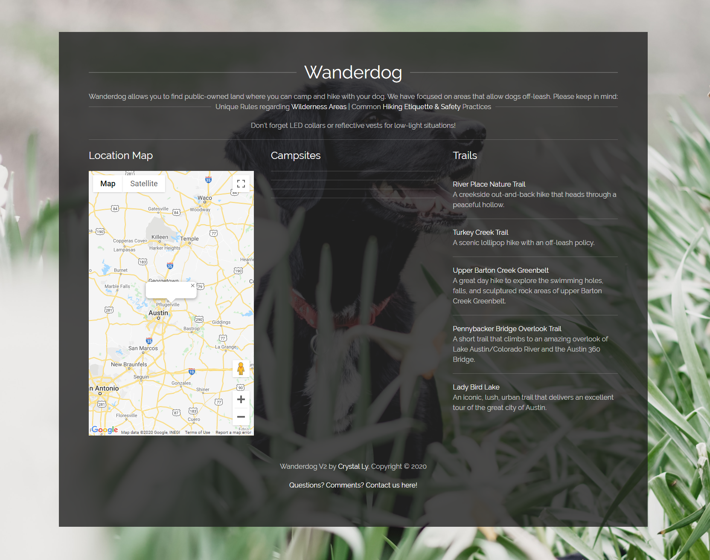

# Project Wanderdog

This application draws from public information to obtain free trails, camp grounds, and parks for your 4-legged pooch!

## Getting Started

* [Click here for Original Wanderdog](https://kimiinglet.github.io/meanLeanFreakGoat/)
* [Click here for Wanderdog V2](https://cml2377.github.io/Wanderdog/)

These instructions will help you locate the perfect spot to spend time with your pups.

As dog owners, we wanted to find areas in the US where we can camp/hike with our dogs off-leash, so that we can spend quality time with our dogs and allow them to explore nature.

## How to use Wanderdog

Using geolocation, Wanderdog maps out locations near you where you can take your dog off-leash.

We used Recreation's API to return campsites where dogs are allowed. We also searched for state parks and forests where you can visit with your dog off-leash. 
Please keep in mind:
 * [Outdoor Ethics](https://lnt.org/) and to 
 * [Tread Lightly!](https://www.treadlightly.org/)

 

## Built With

* [Google Maps](https://www.google.com/maps) - We draw from Google's API to grab locations and map area.
* [USA Data](https://www.data.gov/) - We used US Federal govt. open data to pull public land locations.
* [UIKit](https://getuikit.com/) - We used UIKit's CSS framework. 
* [Unsplash](https://unsplash.com/t/animals) - We used copyright-free images from this site.
* [FontAwesome](https://fontawesome.com/) - We used the dog icon.
* [Google Fonts](https://fonts.google.com/) - We used 1 font style from Google Fonts.
* [Hiking](https://www.hikingproject.com/data) - We used Hiking Project's API to grab trails based on geolocation.

## Contributing

Thanks to Kimi Inglet, Crystal Ly, and Justin Wofford for creating this!
Thanks to Isreal Medina, Brittany Taylor, and Eric Scott for teaching and guiding us through this bootcamp!

## Authors

* [Kimi Inglet](https://github.com/kimiinglet)
* [Crystal Ly](https://github.com/cml2377)
* [Justin Wofford](https://github.com/JayDub21)

## License

This project is licensed under the MIT License - see the [LICENSE.md](LICENSE.md) file for details.

## Acknowledgments

* Hat tip to anyone whose code was used
* Thanks to our dogs, Kimber, Koda, Nox, Orion, and Piper. Thank you for being our best friends.
